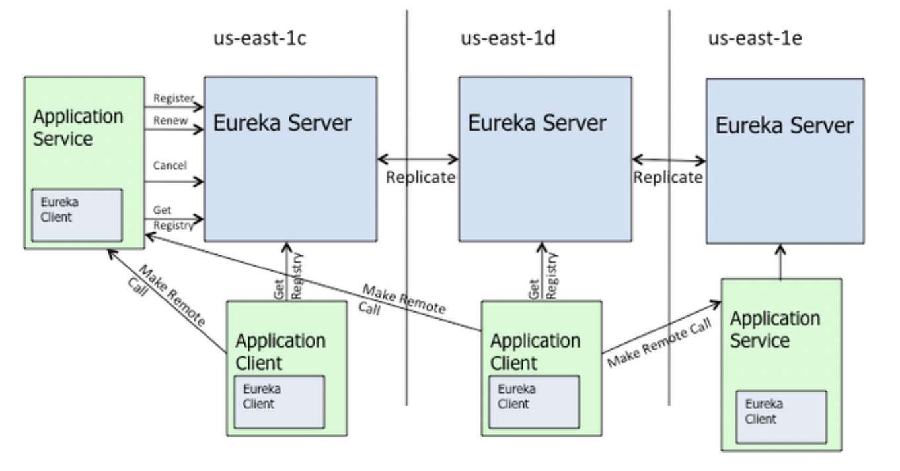

# Eureka工作原理

## Eureka架构



图中操作解说：
```
Register: 将服务注册到EurekaServer；
Renew: 续约，业务服务通过每30s向EurekaServer发送一次心跳来续约的，如果超过3次30s没有发送心跳，EurekaServer会认为此业务服务已经下线，将其从服务注册列表清除；
Cancel: 将服务下架从EurekaServer服务注册列表中清除；
Get Registry: 从EurekaServer中获取服务注册列表更新到业务服务本地列表，每30s更新一次；
Make Remote Call: 服务从注册列表查找远程调用目标的地址发起远程调用。
Replicate: EurekaServer互相同步数据（服务注册列表）。
```

> SpringBoot业务服务作为EurekaServer的客户端；  
> Eureka 是AP，数据基本一致。  
> EurekaClient本地也维护有一个服务注册列表。

## EurekaServer自我保护机制

## Eureka配置


### 1 Eureka 功能

#### 1.1 心跳检测

#### 1.2 健康检查

#### 1.3 负载均衡

#### 1.4 服务注册与发现

+ 服务注册
+ 服务续约
+ 服务下线
+ 获取注册列表信息
+ 服务剔除

### 2 Eureka部署

#### 后台执行命令
```$xslt
nohup java -jar target/eureka-0.0.1-SNAPSHOT.jar > /dev/null 2 > &1 &
```

#### Eureka Server 高可用
通过部署两台以上的 Eureka Server 并互相注册实现；
注册到任意一台 Eureka Server 的微服务都会同步到其他 Server 上。

Eureka Server hostname 相同时，从另一个Eureka Server同步注册微服务会失败？

##### 开发环境：
可以在 application.yml 通过 spring.profiles 定义两个服务器配置，
设置相互注册。  
在IDEA中创建两个启动器，VM options分别指定：
```$xslt
-Dspring.profiles.active=EurekaServer1
-Dspring.profiles.active=EurekaServer2
```

##### 生产环境：
