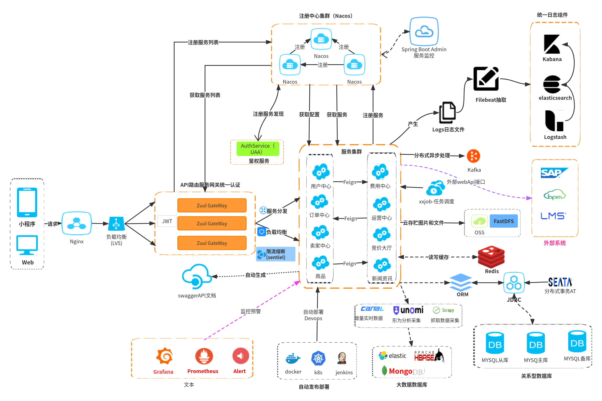

# SpringCloudAlibaba微服务架构

图来自ProcessOn。

## 组件

### Nginx+LVS / CLB

现在都是用云服务器，这部分都被各云服务商的负载均衡服务给替代了，比如ELB\CLB等。

配置域名到云服务器实例的IP端口映射，Alibaba微服务的话应该是将CLB等的域名映射到多个Nacos客户端实例，通过Nacos客户端获取Gateway服务的服务信息（如：实例IP、端口、命名空间、集群、分组、服务名等）再通过Feign/Ribbon等请求Gateway网关。

### 服务网关

+ **Spring Cloud Gateway**
+ Spring Cloud Netflix Zuul

### 注册中心

+ **Spring Cloud Alibaba Nacos**
+ Spring Cloud Netflix Eureka
+ Spring Cloud Consul
+ Spring Cloud Zookeeper

### 配置中心

+ **Spring Cloud Alibaba Nacos**
+ Spring Cloud Config
+ Spring Cloud Zookeeper

### 服务调用

+ **Spirng Cloud OpenFeign**
+ **Dubbo**

### 服务限流熔断降级

+ **Spring Cloud Alibaba Sentinel**
+ Spring Cloud Netflix Hystrix

### 分布式事务

+ **Spring Cloud Alibaba Seata**

### 服务链路追踪

+ **Skywalking**

+ Spring Cloud Sleuth + Zipkin

### 服务安全

+ **Spring Cloud Security**

### 分布式消息

+ **Spring Cloud Stream + RocketMQ /Kafka/RabbitMQ**

### 其他组件

+ **日志服务**
  + ELK
+ **分布式任务调度**
  + xxl-job
+ **监控告警**
+ **大数据接入**