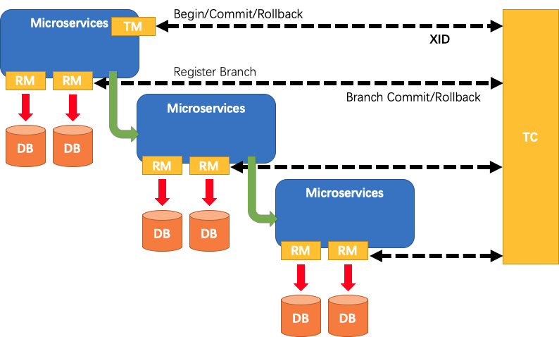

# Seata应用篇

## 简介

Seata 是一款开源的分布式事务解决方案，致力于提供高性能和简单易用的分布式事务服务。Seata 将为用户提供了 AT、TCC、SAGA 和 XA 事务模式。

分布式事务是由一批分支事务组成的全局事务，通常分支事务只是本地事务。

**Seata符合DTP模型，包含三种角色**：

+ TC (Transaction Coordinator) - 事务协调者

  维护全局和分支事务的状态，驱动全局事务提交或回滚。

+ TM (Transaction Manager) - 事务管理器

  定义全局事务的范围：开始全局事务、提交或回滚全局事务。

+ RM (Resource Manager) - 资源管理器

  管理分支事务处理的资源，与TC交谈以注册分支事务和报告分支事务的状态，并驱动分支事务提交或回滚。

其中，TC 为单独部署的 Server 服务端，TM 和 RM 为嵌入到应用中的 Client 客户端。

**Seata分布式事务生命周期**：



1. TM 请求 TC 开启一个全局事务。TC 会生成一个 XID 作为该全局事务的编号。XID，会在微服务的调用链路中传播，保证将多个微服务的子事务关联在一起。

2. RM 请求 TC 将本地事务注册为全局事务的分支事务，通过全局事务的 XID 进行关联。

3. TM 请求 TC 告诉 XID 对应的全局事务是进行提交还是回滚。

4. TC 驱动 RM 们将 XID 对应的自己的本地事务进行提交还是回滚。

> Seata AT规范实现，采用了反向补偿机制，大体流程和2PC类似，只不过各个分支事务执行成功直接提交，并记录操作日志到一个undolog日志文件，最终TC根据各个分支事务状态进行提交（不是事务提交而是做资源释放等，如：清理日志、清除事务编号等等）或补偿（补偿是读取undolog将数据写回去，其中包括一些隔离性检查避免并发提交或回退补偿）。


## 基本应用

### 服务端启动

[Docker部署](使用 Docker 部署 Seata Server (1.5.0))：[seataio/seata-server](https://hub.docker.com/r/seataio/seata-server)

```shell
# 只是测试，简单启动
docker pull seataio/seata-server:1.4.0
docker run --name seata-server -p 8091:8091 -p 7091:7091 seataio/seata-server:1.4.0
```

### 模拟分布式事务场景

比如配置多数据源（方案很多）。msa-seata 模拟了单个服务连接多数据源的分布式事务场景。

+ Spring JdbcTemplate 多数据源
+ Spring Data JPA 多数据源
+ Mybatis 多数据源
+ baomidou 多数据源
+ Sharding-JDBC 多数据源

### 引入Seata客户端（作为TM、RM）

1. **引入依赖**

   ```xml
   <dependency>
       <groupId>io.seata</groupId>
       <artifactId>seata-spring-boot-starter</artifactId>
       <version>${seata-spring-boot.version}</version>
   </dependency>
   ```

2. **修改配置**

   支持 file 、nacos 、eureka、redis、zk、consul、etcd3、sofa 配置形式。

   配置内容主要分为网络连接、事务分组、客户端重试、事务回滚等。

3. **代码添加数据源代理**

   封装 javax.sql.DataSource 数据源实例。移除Spring默认的数据源自动配置类。

4. **事务发起方法上添加注解 @GlobalTransactional**

### 测试日志

**Seata客户端**

```verilog
2022-06-25 13:29:14.631  INFO 23055 --- [nio-8081-exec-1] t.k.m.seata.controller.OrderController   : 收到下单请求,用户:10001, 商品编号:101
2022-06-25 13:29:14.636  INFO 23055 --- [nio-8081-exec-1] io.seata.tm.TransactionManagerHolder     : TransactionManager Singleton io.seata.tm.DefaultTransactionManager@4473a7d1
2022-06-25 13:29:14.640  INFO 23055 --- [Send_TMROLE_1_1] i.s.c.r.netty.NettyClientChannelManager  : will connect to 127.0.0.1:8091
2022-06-25 13:29:14.642  INFO 23055 --- [Send_TMROLE_1_1] i.s.core.rpc.netty.NettyPoolableFactory  : NettyPool create channel to transactionRole:TMROLE,address:127.0.0.1:8091,msg:< RegisterTMRequest{applicationId='msa-seata', transactionServiceGroup='my_test_tx_group'} >
2022-06-25 13:29:14.646  INFO 23055 --- [Send_TMROLE_1_1] i.s.c.rpc.netty.TmNettyRemotingClient    : register TM success. client version:1.4.0, server version:1.4.0,channel:[id: 0x4493352c, L:/127.0.0.1:48446 - R:/127.0.0.1:8091]
2022-06-25 13:29:14.647  INFO 23055 --- [Send_TMROLE_1_1] i.s.core.rpc.netty.NettyPoolableFactory  : register success, cost 4 ms, version:1.4.0,role:TMROLE,channel:[id: 0x4493352c, L:/127.0.0.1:48446 - R:/127.0.0.1:8091]
2022-06-25 13:29:14.651  INFO 23055 --- [nio-8081-exec-1] i.seata.tm.api.DefaultGlobalTransaction  : Begin new global transaction [172.17.0.2:8091:283953351723327488]
2022-06-25 13:29:14.652  INFO 23055 --- [nio-8081-exec-1] t.k.m.s.service.impl.OrderServiceImpl    : =============用户下单=================
2022-06-25 13:29:14.658  INFO 23055 --- [nio-8081-exec-1] t.k.m.s.config.DynamicRoutingDataSource  : 当前数据源 [ORDER]
2022-06-25 13:29:14.658  INFO 23055 --- [nio-8081-exec-1] i.s.c.rpc.netty.RmNettyRemotingClient    : will register resourceId:jdbc:mysql://localhost:3306/seata_order
2022-06-25 13:29:14.660  INFO 23055 --- [ctor_RMROLE_1_1] io.seata.rm.AbstractRMHandler            : the rm client received response msg [version=1.4.0,extraData=null,identified=true,resultCode=null,msg=null] from tc server.
2022-06-25 13:29:14.661  INFO 23055 --- [nio-8081-exec-1] i.s.c.rpc.netty.RmNettyRemotingClient    : will register resourceId:jdbc:mysql://localhost:3306/seata_order
2022-06-25 13:29:14.661  INFO 23055 --- [nio-8081-exec-1] t.k.m.s.config.DynamicRoutingDataSource  : 当前数据源 [ORDER]
2022-06-25 13:29:14.663  INFO 23055 --- [ctor_RMROLE_1_1] io.seata.rm.AbstractRMHandler            : the rm client received response msg [version=1.4.0,extraData=null,identified=true,resultCode=null,msg=null] from tc server.
2022-06-25 13:29:14.798  INFO 23055 --- [nio-8081-exec-1] t.k.m.s.service.impl.OrderServiceImpl    : 保存订单成功
2022-06-25 13:29:14.798  INFO 23055 --- [nio-8081-exec-1] t.k.m.s.service.impl.StorageServiceImpl  : =============扣减库存=================
2022-06-25 13:29:14.798  INFO 23055 --- [nio-8081-exec-1] t.k.m.s.service.impl.StorageServiceImpl  : 当前 XID: 172.17.0.2:8091:283953351723327488
2022-06-25 13:29:14.798  INFO 23055 --- [nio-8081-exec-1] t.k.m.s.service.impl.StorageServiceImpl  : 检查 101 库存
2022-06-25 13:29:14.799  INFO 23055 --- [nio-8081-exec-1] t.k.m.s.config.DynamicRoutingDataSource  : 当前数据源 [STORAGE]
2022-06-25 13:29:14.800  INFO 23055 --- [nio-8081-exec-1] i.s.c.rpc.netty.RmNettyRemotingClient    : will register resourceId:jdbc:mysql://localhost:3306/seata_storage
2022-06-25 13:29:14.802  INFO 23055 --- [ctor_RMROLE_1_1] io.seata.rm.AbstractRMHandler            : the rm client received response msg [version=1.4.0,extraData=null,identified=true,resultCode=null,msg=null] from tc server.
2022-06-25 13:29:14.804  INFO 23055 --- [nio-8081-exec-1] t.k.m.s.service.impl.StorageServiceImpl  : 开始扣减 101 库存
2022-06-25 13:29:14.804  INFO 23055 --- [nio-8081-exec-1] t.k.m.s.config.DynamicRoutingDataSource  : 当前数据源 [STORAGE]
2022-06-25 13:29:14.834  INFO 23055 --- [nio-8081-exec-1] t.k.m.s.service.impl.StorageServiceImpl  : 扣减 101 库存结果:操作成功
2022-06-25 13:29:14.834  INFO 23055 --- [nio-8081-exec-1] t.k.m.s.service.impl.AccountServiceImpl  : =============用户账户扣款=================
2022-06-25 13:29:14.834  INFO 23055 --- [nio-8081-exec-1] t.k.m.s.service.impl.AccountServiceImpl  : 当前 XID: 172.17.0.2:8091:283953351723327488
2022-06-25 13:29:14.834  INFO 23055 --- [nio-8081-exec-1] t.k.m.s.service.impl.AccountServiceImpl  : 检查用户 10001 余额
2022-06-25 13:29:14.834  INFO 23055 --- [nio-8081-exec-1] t.k.m.s.config.DynamicRoutingDataSource  : 当前数据源 [ACCOUNT]
2022-06-25 13:29:14.834  INFO 23055 --- [nio-8081-exec-1] i.s.c.rpc.netty.RmNettyRemotingClient    : will register resourceId:jdbc:mysql://localhost:3306/seata_account
2022-06-25 13:29:14.836  WARN 23055 --- [nio-8081-exec-1] t.k.m.s.service.impl.AccountServiceImpl  : 用户 10001 余额不足，当前余额:0
2022-06-25 13:29:14.837  INFO 23055 --- [ctor_RMROLE_1_1] io.seata.rm.AbstractRMHandler            : the rm client received response msg [version=1.4.0,extraData=null,identified=true,resultCode=null,msg=null] from tc server.
2022-06-25 13:29:14.843  INFO 23055 --- [h_RMROLE_1_1_16] i.s.c.r.p.c.RmBranchRollbackProcessor    : rm handle branch rollback process:xid=172.17.0.2:8091:283953351723327488,branchId=283953352448942080,branchType=AT,resourceId=jdbc:mysql://localhost:3306/seata_storage,applicationData=null
2022-06-25 13:29:14.844  INFO 23055 --- [h_RMROLE_1_1_16] io.seata.rm.AbstractRMHandler            : Branch Rollbacking: 172.17.0.2:8091:283953351723327488 283953352448942080 jdbc:mysql://localhost:3306/seata_storage
2022-06-25 13:29:14.876  INFO 23055 --- [h_RMROLE_1_1_16] i.s.r.d.undo.AbstractUndoLogManager      : xid 172.17.0.2:8091:283953351723327488 branch 283953352448942080, undo_log deleted with GlobalFinished
2022-06-25 13:29:14.877  INFO 23055 --- [h_RMROLE_1_1_16] io.seata.rm.AbstractRMHandler            : Branch Rollbacked result: PhaseTwo_Rollbacked
2022-06-25 13:29:14.880  INFO 23055 --- [h_RMROLE_1_2_16] i.s.c.r.p.c.RmBranchRollbackProcessor    : rm handle branch rollback process:xid=172.17.0.2:8091:283953351723327488,branchId=283953352427970560,branchType=AT,resourceId=jdbc:mysql://localhost:3306/seata_order,applicationData=null
2022-06-25 13:29:14.881  INFO 23055 --- [h_RMROLE_1_2_16] io.seata.rm.AbstractRMHandler            : Branch Rollbacking: 172.17.0.2:8091:283953351723327488 283953352427970560 jdbc:mysql://localhost:3306/seata_order
2022-06-25 13:29:14.881  INFO 23055 --- [h_RMROLE_1_2_16] t.k.m.s.config.DynamicRoutingDataSource  : 当前数据源 [ORDER]
2022-06-25 13:29:14.888  INFO 23055 --- [h_RMROLE_1_2_16] i.s.r.d.undo.AbstractUndoLogManager      : xid 172.17.0.2:8091:283953351723327488 branch 283953352427970560, undo_log added with GlobalFinished
2022-06-25 13:29:14.888  INFO 23055 --- [h_RMROLE_1_2_16] io.seata.rm.AbstractRMHandler            : Branch Rollbacked result: PhaseTwo_Rollbacked
2022-06-25 13:29:14.890  INFO 23055 --- [h_RMROLE_1_3_16] i.s.c.r.p.c.RmBranchRollbackProcessor    : rm handle branch rollback process:xid=172.17.0.2:8091:283953351723327488,branchId=283953352289558528,branchType=AT,resourceId=jdbc:mysql://localhost:3306/seata_order,applicationData=null
2022-06-25 13:29:14.890  INFO 23055 --- [h_RMROLE_1_3_16] io.seata.rm.AbstractRMHandler            : Branch Rollbacking: 172.17.0.2:8091:283953351723327488 283953352289558528 jdbc:mysql://localhost:3306/seata_order
2022-06-25 13:29:14.891  INFO 23055 --- [h_RMROLE_1_3_16] t.k.m.s.config.DynamicRoutingDataSource  : 当前数据源 [ORDER]
2022-06-25 13:29:14.901  INFO 23055 --- [h_RMROLE_1_3_16] i.s.r.d.undo.AbstractUndoLogManager      : xid 172.17.0.2:8091:283953351723327488 branch 283953352289558528, undo_log deleted with GlobalFinished
2022-06-25 13:29:14.902  INFO 23055 --- [h_RMROLE_1_3_16] io.seata.rm.AbstractRMHandler            : Branch Rollbacked result: PhaseTwo_Rollbacked
2022-06-25 13:29:14.904  INFO 23055 --- [h_RMROLE_1_4_16] i.s.c.r.p.c.RmBranchRollbackProcessor    : rm handle branch rollback process:xid=172.17.0.2:8091:283953351723327488,branchId=283953352134369280,branchType=AT,resourceId=jdbc:mysql://localhost:3306/seata_order,applicationData=null
2022-06-25 13:29:14.904  INFO 23055 --- [h_RMROLE_1_4_16] io.seata.rm.AbstractRMHandler            : Branch Rollbacking: 172.17.0.2:8091:283953351723327488 283953352134369280 jdbc:mysql://localhost:3306/seata_order
2022-06-25 13:29:14.904  INFO 23055 --- [h_RMROLE_1_4_16] t.k.m.s.config.DynamicRoutingDataSource  : 当前数据源 [ORDER]
2022-06-25 13:29:14.911  INFO 23055 --- [h_RMROLE_1_4_16] i.s.r.d.undo.AbstractUndoLogManager      : xid 172.17.0.2:8091:283953351723327488 branch 283953352134369280, undo_log added with GlobalFinished
2022-06-25 13:29:14.911  INFO 23055 --- [h_RMROLE_1_4_16] io.seata.rm.AbstractRMHandler            : Branch Rollbacked result: PhaseTwo_Rollbacked
2022-06-25 13:29:14.914  INFO 23055 --- [nio-8081-exec-1] i.seata.tm.api.DefaultGlobalTransaction  : [172.17.0.2:8091:283953351723327488] rollback status: Rollbacked
2022-06-25 13:29:14.926 ERROR 23055 --- [nio-8081-exec-1] o.a.c.c.C.[.[.[/].[dispatcherServlet]    : Servlet.service() for servlet [dispatcherServlet] in context with path [] threw exception [Request processing failed; nested exception is java.lang.RuntimeException: 余额不足] with root cause
java.lang.RuntimeException: 余额不足
......
```

**Seata服务端**

```verilog
05:29:14.645  INFO --- [ttyServerNIOWorker_1_8_16] i.s.c.r.processor.server.RegTmProcessor  : TM register success,message:RegisterTMRequest{applicationId='msa-seata', transactionServiceGroup='my_test_tx_group'},channel:[id: 0x67581597, L:/172.17.0.2:8091 - R:/172.17.0.1:45748],client version:1.4.0
05:29:14.649  INFO --- [verHandlerThread_1_30_500] i.s.s.coordinator.DefaultCoordinator     : Begin new global transaction applicationId: msa-seata,transactionServiceGroup: my_test_tx_group, transactionName: createOrder,timeout:60000,xid:172.17.0.2:8091:283953351723327488
05:29:14.649  INFO --- [     batchLoggerPrint_1_1] i.s.c.r.p.server.BatchLogHandler         : SeataMergeMessage timeout=60000,transactionName=createOrder
,clientIp:172.17.0.1,vgroup:my_test_tx_group
05:29:14.660  INFO --- [verHandlerThread_1_31_500] i.s.c.r.processor.server.RegRmProcessor  : RM register success,message:RegisterRMRequest{resourceIds='jdbc:mysql://localhost:3306/seata_order', applicationId='msa-seata', transactionServiceGroup='my_test_tx_group'},channel:[id: 0x86aa7645, L:/172.17.0.2:8091 - R:/172.17.0.1:45718],client version:1.4.0
05:29:14.662  INFO --- [verHandlerThread_1_32_500] i.s.c.r.processor.server.RegRmProcessor  : RM register success,message:RegisterRMRequest{resourceIds='jdbc:mysql://localhost:3306/seata_order', applicationId='msa-seata', transactionServiceGroup='my_test_tx_group'},channel:[id: 0x86aa7645, L:/172.17.0.2:8091 - R:/172.17.0.1:45718],client version:1.4.0
05:29:14.747  INFO --- [     batchLoggerPrint_1_1] i.s.c.r.p.server.BatchLogHandler         : SeataMergeMessage xid=172.17.0.2:8091:283953351723327488,branchType=AT,resourceId=jdbc:mysql://localhost:3306/seata_order,lockKey=order_tbl:4
,clientIp:172.17.0.1,vgroup:my_test_tx_group
05:29:14.747  INFO --- [verHandlerThread_1_33_500] i.seata.server.coordinator.AbstractCore  : Register branch successfully, xid = 172.17.0.2:8091:283953351723327488, branchId = 283953352134369280, resourceId = jdbc:mysql://localhost:3306/seata_order ,lockKeys = order_tbl:4
05:29:14.784  INFO --- [     batchLoggerPrint_1_1] i.s.c.r.p.server.BatchLogHandler         : SeataMergeMessage xid=172.17.0.2:8091:283953351723327488,branchType=AT,resourceId=jdbc:mysql://localhost:3306/seata_order,lockKey=undo_log:1;order_tbl:4
,clientIp:172.17.0.1,vgroup:my_test_tx_group
05:29:14.784  INFO --- [verHandlerThread_1_34_500] i.seata.server.coordinator.AbstractCore  : Register branch successfully, xid = 172.17.0.2:8091:283953351723327488, branchId = 283953352289558528, resourceId = jdbc:mysql://localhost:3306/seata_order ,lockKeys = undo_log:1;order_tbl:4
05:29:14.801  INFO --- [verHandlerThread_1_35_500] i.s.c.r.processor.server.RegRmProcessor  : RM register success,message:RegisterRMRequest{resourceIds='jdbc:mysql://localhost:3306/seata_storage', applicationId='msa-seata', transactionServiceGroup='my_test_tx_group'},channel:[id: 0x86aa7645, L:/172.17.0.2:8091 - R:/172.17.0.1:45718],client version:1.4.0
05:29:14.817  INFO --- [     batchLoggerPrint_1_1] i.s.c.r.p.server.BatchLogHandler         : SeataMergeMessage xid=172.17.0.2:8091:283953351723327488,branchType=AT,resourceId=jdbc:mysql://localhost:3306/seata_order,lockKey=storage_tbl:1
,clientIp:172.17.0.1,vgroup:my_test_tx_group
05:29:14.817  INFO --- [verHandlerThread_1_36_500] i.seata.server.coordinator.AbstractCore  : Register branch successfully, xid = 172.17.0.2:8091:283953351723327488, branchId = 283953352427970560, resourceId = jdbc:mysql://localhost:3306/seata_order ,lockKeys = storage_tbl:1
05:29:14.822  INFO --- [     batchLoggerPrint_1_1] i.s.c.r.p.server.BatchLogHandler         : SeataMergeMessage xid=172.17.0.2:8091:283953351723327488,branchType=AT,resourceId=jdbc:mysql://localhost:3306/seata_storage,lockKey=storage_tbl:1;undo_log:1
,clientIp:172.17.0.1,vgroup:my_test_tx_group
05:29:14.823  INFO --- [verHandlerThread_1_37_500] i.seata.server.coordinator.AbstractCore  : Register branch successfully, xid = 172.17.0.2:8091:283953351723327488, branchId = 283953352448942080, resourceId = jdbc:mysql://localhost:3306/seata_storage ,lockKeys = storage_tbl:1;undo_log:1
05:29:14.836  INFO --- [verHandlerThread_1_38_500] i.s.c.r.processor.server.RegRmProcessor  : RM register success,message:RegisterRMRequest{resourceIds='jdbc:mysql://localhost:3306/seata_account', applicationId='msa-seata', transactionServiceGroup='my_test_tx_group'},channel:[id: 0x86aa7645, L:/172.17.0.2:8091 - R:/172.17.0.1:45718],client version:1.4.0
05:29:14.840  INFO --- [     batchLoggerPrint_1_1] i.s.c.r.p.server.BatchLogHandler         : SeataMergeMessage xid=172.17.0.2:8091:283953351723327488,extraData=null
,clientIp:172.17.0.1,vgroup:my_test_tx_group
05:29:14.879  INFO --- [verHandlerThread_1_39_500] io.seata.server.coordinator.DefaultCore  : Rollback branch transaction successfully, xid = 172.17.0.2:8091:283953351723327488 branchId = 283953352448942080
05:29:14.889  INFO --- [verHandlerThread_1_39_500] io.seata.server.coordinator.DefaultCore  : Rollback branch transaction successfully, xid = 172.17.0.2:8091:283953351723327488 branchId = 283953352427970560
05:29:14.903  INFO --- [verHandlerThread_1_39_500] io.seata.server.coordinator.DefaultCore  : Rollback branch transaction successfully, xid = 172.17.0.2:8091:283953351723327488 branchId = 283953352289558528
05:29:14.912  INFO --- [verHandlerThread_1_39_500] io.seata.server.coordinator.DefaultCore  : Rollback branch transaction successfully, xid = 172.17.0.2:8091:283953351723327488 branchId = 283953352134369280
05:29:14.912  INFO --- [verHandlerThread_1_39_500] io.seata.server.coordinator.DefaultCore  : Rollback global transaction successfully, xid = 172.17.0.2:8091:283953351723327488.
```


## 企业级应用方案

简言之，微服务架构体系中Seata是配合Nacos注册中心、配置中心、Feign、Ribbon、Sentinel共同使用的。

