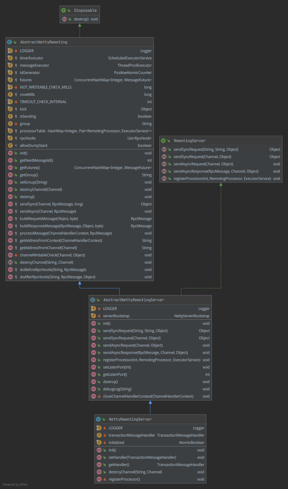

# Seata原理篇

结合应用篇的实例和测试日志，分析Seata Client 和 Server 交互、控制原理。

目标：

+ 事务控制全流程
  + MySQL事务控制
  + JDBC事务控制
  + Mybatis事务控制
  + Spring事务及传播机制
  + JTA分布式事务控制
  + Sharding-JDBC分布式事务控制
  + Seata分布式事务控制
  + Seata、Spring、Mybatis、JDBC这一层层的数据源和事务配置是怎么装配的


## Seata客户端（TM、RM）

还是从`seata-spring-boot-starter`的自动配置类开始分析。


## Seata服务端（TC）

### [AT模式](https://seata.io/zh-cn/docs/dev/mode/at-mode.html)工作流程

也是主要分为两个阶段：

**一阶段**：所有参与事务的分支、本地事务提交(Commit)业务数据和生成回滚日志(undolog)，释放本地锁和连接资源。

**二阶段**(异步)：事务协调者(TC)根据所有分支事务状态决定本次全局事务是提交(Commit)还是回滚(Rollback)，回滚的话通过一阶段的回滚日志进行反向补偿。

详细流程参考（别人画的图，很清晰全面，将源码核心逻辑都画出来了，比官网讲的好理解多了，不过官网对锁讲的比较细，结合看吧）：
https://www.processon.com/view/link/6007f5c00791294a0e9b611a

### 源码编译启动

Seata默认采用[AT模式](https://seata.io/zh-cn/docs/dev/mode/at-mode.html)。

**启动脚本参数**：

```shell
exec /usr/lib/jvm/java-1.8.0-openjdk-amd64/bin/java -server 
-Xmx2048m -Xms2048m -Xmn1024m -Xss512k -XX:SurvivorRatio=10 -XX:MetaspaceSize=128m 
-XX:MaxMetaspaceSize=256m -XX:MaxDirectMemorySize=1024m -XX:-OmitStackTraceInFastThrow 
-XX:-UseAdaptiveSizePolicy -XX:+HeapDumpOnOutOfMemoryError 
-XX:HeapDumpPath=/opt/seata/logs/java_heapdump.hprof -XX:+DisableExplicitGC 
-XX:+CMSParallelRemarkEnabled -XX:+UseCMSInitiatingOccupancyOnly 
-XX:CMSInitiatingOccupancyFraction=75 -Xloggc:/opt/seata/logs/seata_gc.log -verbose:gc 
-Dio.netty.leakDetectionLevel=advanced -Dlogback.color.disable-for-bat=true 
-classpath /opt/seata/conf:/opt/seata/lib/* -Dapp.name=seata-server -Dapp.pid=31129 
-Dapp.repo=/opt/seata/lib -Dapp.home=/opt/seata -Dbasedir=/opt/seata io.seata.server.Server
```

直接启动Server main() 方法会报错，因为远程调用需要中间生成的代码，估计默认用的protobuf协议。

```verilog
java: 程序包io.seata.serializer.protobuf.generated不存在
```

可以往IDEA安装protobuf support插件, 然后编译seata-serializer-protobuf生成protobuf中间源码文件。

根目录`mvn clean package install -Dmaven.test.skip=true`。

**事务会话持久化配置修改：**

参考官方[部署指南](https://seata.io/zh-cn/docs/ops/deploy-guide-beginner.html)，支持三种存储方式：file、db、redis。

| 存储方式 | 优点                                                       | 缺点                                                         |
| -------- | ---------------------------------------------------------- | ------------------------------------------------------------ |
| file     | 数据读写效率高，配置简单                                   | 文件无法共享，不支持集群高可用部署，会话信息可读性差         |
| db       | 支持集群高可用部署，会话信息可读性高                       | 数据读写、同步效率低，额外依赖DB（应该不算缺点，数据库一般都是应用的必备组件） |
| redis    | 支持集群高可用部署，会话信息可读性高，数据读写、同步效率高 | 额外依赖Redis（应该不算缺点，同上）                          |

这里只是测试，选db模式（Mysql）并设置数据源连接参数，需要额外创建名为seata的数据库再建3张表，搜索源码可以找到建表sql脚本（script/server/db/mysql.sql），执行建表语句即可。

然后继续尝试源码启动Seata Server，出现下面信息，即源码启动成功：

```verilog
16:35:24.603  INFO --- [                     main] io.seata.config.FileConfiguration        : The file name of the operation is registry
16:35:24.607  INFO --- [                     main] io.seata.config.FileConfiguration        : The configuration file used is /home/lee/mywork/java/micro_service/github/seata-1.4.0/server/target/classes/registry.conf
16:35:24.650  INFO --- [                     main] io.seata.config.FileConfiguration        : The file name of the operation is file.conf
16:35:24.651  INFO --- [                     main] io.seata.config.FileConfiguration        : The configuration file used is file.conf
16:35:25.115  INFO --- [                     main] com.alibaba.druid.pool.DruidDataSource   : {dataSource-1} inited
16:35:25.303  INFO --- [                     main] i.s.core.rpc.netty.NettyServerBootstrap  : Server started, listen port: 8091
```

然后再执行测试DEMO，输出信息和docker启动的Seata-Server输出的信息一致就可以继续分析工作流程了。

### 源码工作流程分析

结合流程图看。

**ConfigurationFactory** 解析 **file.conf** 获取的 **FileConfiguration**实例内容：

```java
result = {Configuration$$EnhancerByCGLIB$$ff938893@1915} "io.seata.config.FileConfiguration@6646153"
 CGLIB$BOUND = true
 CGLIB$CALLBACK_0 = {ConfigurationCache$lambda@2203} 
  arg$1 = {FileConfiguration@2204} 
   fileConfig = {SimpleFileConfig@2205} 
    fileConfig = {SimpleConfig@2213} "Config(SimpleConfigObject({"awt":{"toolkit":"sun.awt.X11.XToolkit"},"file":{"encoding":{"pkg":"sun.io"},"separator":"/"},"intellij":{"debug":{"agent":"true"}},"java":{"awt":{"graphicsenv":"sun.awt.X11GraphicsEnvironment","printerjob":"sun.print.PSPrinterJob"},"class":{"path":"/usr/lib/jvm/java-1.8.0-openjdk-amd64/jre/lib/charsets.jar:/usr/lib/jvm/java-1.8.0-openjdk-amd64/jre/lib/ext/cldrdata.jar:/usr/lib/jvm/java-1.8.0-openjdk-amd64/jre/lib/ext/dnsns.jar:/usr/lib/jvm/java-1.8.0-openjdk-amd64/jre/lib/ext/jaccess.jar:/usr/lib/jvm/java-1.8.0-openjdk-amd64/jre/lib/ext/localedata.jar:/usr/lib/jvm/java-1.8.0-openjdk-amd64/jre/lib/ext/nashorn.jar:/usr/lib/jvm/java-1.8.0-openjdk-amd64/jre/lib/ext/sunec.jar:/usr/lib/jvm/java-1.8.0-openjdk-amd64/jre/lib/ext/sunjce_provider.jar:/usr/lib/jvm/java-1.8.0-openjdk-amd64/jre/lib/ext/sunpkcs11.jar:/usr/lib/jvm/java-1.8.0-openjdk-amd64/jre/lib/ext/zipfs.jar:/usr/lib/jvm/java-1.8.0-openjdk-amd64/jre/lib/jce.jar:/usr/lib/jvm/java-1.8.0-openjdk-amd64/jre/li"
     object = {SimpleConfigObject@2217}  size = 13
      "store" -> {SimpleConfigObject@2235}  size = 4
      "java" -> {SimpleConfigObject@2237}  size = 12
      "server" -> {SimpleConfigObject@2239}  size = 1
      "file" -> {SimpleConfigObject@2241}  size = 2
      "awt" -> {SimpleConfigObject@2243}  size = 1
      "sun" -> {SimpleConfigObject@2245}  size = 9
      "path" -> {SimpleConfigObject@2247}  size = 1
      "user" -> {SimpleConfigObject@2249}  size = 6
      "intellij" -> {SimpleConfigObject@2251}  size = 1
      "os" -> {SimpleConfigObject@2253}  size = 3
      "line" -> {SimpleConfigObject@2255}  size = 1
      "service" -> {SimpleConfigObject@2257}  size = 3
      "jboss" -> {SimpleConfigObject@2259}  size = 1
   configOperateExecutor = {ThreadPoolExecutor@2206} "java.util.concurrent.ThreadPoolExecutor@21507a04[Running, pool size = 1, active threads = 0, queued tasks = 0, completed tasks = 2]"
   configListenersMap = {ConcurrentHashMap@2207}  size = 0
   listenedConfigMap = {HashMap@2208}  size = 0
   targetFilePath = "/home/lee/mywork/java/micro_service/github/seata-1.4.0/server/target/classes/file.conf"
   targetFileLastModified = 1656174240000
   name = "file.conf"
   fileListener = {FileConfiguration$FileListener@2211} 
   allowDynamicRefresh = true
```

**NettyRemotingServer 数据结构**



**DataBaseSessionManager 数据结构**


**DefaultCoordinator 数据结构**


**开启全局事务**

存储会话信息到global_table

```verilog
xid                                  |transaction_id    |status|application_id|transaction_service_group|transaction_name|timeout|begin_time   |application_data|gmt_create         |gmt_modified       |
-------------------------------------+------------------+------+--------------+-------------------------+----------------+-------+-------------+----------------+-------------------+-------------------+
192.168.101.1:8091:288984327089295360|288984327089295360|     1|msa-seata     |my_test_tx_group         |createOrder     |  60000|1657334432647|                |2022-07-09 10:40:32|2022-07-09 10:40:32|
```

