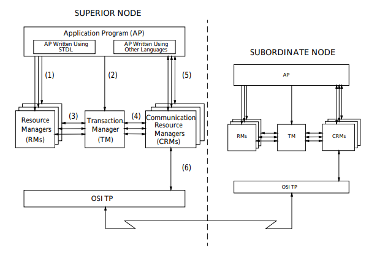

# 分布式事务基础

## 事务

### 事务需要考虑的四个特性ACID

+ **原子性**（atomicity）

+ **一致性**（consistency）

+ **隔离性**（isolation）

+ **持久性**（durability）

  事务提交导致的更改不会在后续的系统或媒体故障中失效。

## 本地事务

**数据库（以MySQL为例）本身支持的事务操作基于同一个`连接对象`。如果事务控制的操作都在同一个连接中完成其事务就是本地事务**。

### MySQL事务隔离级别及原理

参考databases仓库。

### 本地事务操作

#### JDBC操作本地事务

#### Mybatis本地事务封装

#### Spring本地事务封装

## 分布式事务

**对应本地事务，如果事务控制的操作跨多个连接，则是分布式事务**。比如：

+ 单体Web应用某事务控制的多个操作需连接多个数据库
+ 某事务控制的多个操作涉及多个微服务连接各自的数据库
+ 单体Web应用某事务控制的多个操作创建了多个连接连接同一个数据库

> 网上很多水文将分布式事务等同于跨库，跨库只是其中一种情况，分布式事务是跨连接。

### X/Open DTP模型＆XA规范

open group 对分布式事务处理提出了模型和规范，分别称为DTP(Distributed Transaction Processing)模型和XA规范。

[Distributed Transaction Processing: Reference Model, Version 3](https://pubs.opengroup.org/onlinepubs/9294999599/toc.pdf)

[Distributed Transaction Processing: The XA Specification](https://pubs.opengroup.org/onlinepubs/009680699/toc.pdf)

DTP模型：

包含５个基本组件：

**应用程序(Application Program ，简称AP)**：用于定义事务边界(即定义事务的开始和结束)，并且在事务边界内对资源进行操作，通常决定事务的提交或回滚。比如业务代码开启事务，依次操作多个SQL，有异常就申请回退，正常就提交。
**资源管理器(Resource Manager，简称RM)**：如数据库、文件系统等，并提供访问资源的方式。比如某个SQL操作的执行。
**事务管理器(Transaction Manager ，简称TM)**：负责分配事务唯一标识，监控事务的执行进度，并负责事务的提交、回滚等。其实是统筹各个RM中事务及资源操作执行，比如监控到有节点事务异常通知所有节点执行回滚，所有节点执行成功则通知所有节点提交。
**通信资源管理器(Communication Resource Manager，简称CRM)**：控制一个TM域(TM domain)内或者跨TM域的分布式应用之间的通信。
**通信协议(Communication Protocol，简称CP)**：提供CRM提供的分布式应用节点之间的底层通信服务。

> 常见名词的关系
>
> + XA规范定义了DTP模型组件RMs和TM之间的接口规范
> + XA规范借鉴及优化了两阶段提交（2PC）协议
> + TCC是另一种分布式事务规范
> + JTA（Java Transaction API）是Java根据XA、DTP那套模型和规范来指定一套分布式事务API接口，由各个资源（如各种数据库）提供商实现。
>
> 疑问：
>
> + spring cloud分布式事务跨TM域的场景是怎么样的？同一个TM域中TM是中心化的？多个TM域是去中心化的？

#### XA 2PC 原理

两阶段提交流程，很简单找了张网图:

**2PC的问题**：

+ **同步阻塞带来的性能问题**

  第一阶段预提交后资源锁定等待TM通知提交或回滚后才能释放锁定。

  是资源层面的分布式事务，强一致性。

+ **TM单点问题**

  事务管理器TM宕机的话可能导致事故发生时处于预提交阻塞状态的资源一直出于阻塞状态。

+ **数据不一致问题**

  第二阶段万一提交操作部分RM因为网络没有收到提交命令最后如果超时回滚的话，就会发生数据不一致问题。

#### TCC原理

由于XA的问题应用较少，更多的是使用TCC，TCC（Try、Confirm、Cancel）分为３个操作。

参考网文：[分布式事务之解决方案（TCC）](https://cloud.tencent.com/developer/article/1547147)，对应Demo: [dtx-tcc-demo](https://github.com/yangguang-create/dtx)

+ **Try**

  做业务检查（一致性）及资源预留（隔离），此阶段仅是一个初步操作，它和后续的Confirm一起才能真正构成一个完整的业务逻辑。

  TCC此阶段不会像XA一样直接锁定资源，而是修改字段的值，同时添加一个字段（冻结字段）记录操作后的差值，其他线程可以继续修改这两个字段的值。

+ **Confirm**

  确认提交，Try阶段所有分支事务执行成功后开始执行Confirm。

  这时会将新增的冻结字段的值清零，如果失败的化，执行cancel。

+ **Cancel**

  comfirm阶段有分支事务执行失败，需要执行回滚操作，将冻结字段的值加回原字段。

**优点**：

比较灵活。

**问题**：

实现比较麻烦，各阶段都需要手动实现。可能存在空回滚、幂等、悬挂问题，需要手动在各阶段编码处理。

+ **幂等问题**

  因为网络调用无法保证请求一定能到达，所以都会有重试机制，重试机制可能引入幂等问题。

  解决思路是增加执行状态，每次执行前都查询该状态。

+ **空回滚**

  Try 阶段可能由于网络问题没收到指令根本没执行，但是故障恢复时执行了cancel操作

+ **悬挂**

  悬挂就是对于一个分布式事务，其二阶段Cancel接口比Try接口先执行。

  出现原因是在RPC调用分支事务try时，先注册分支事务，再执行RPC调用，如果此时RPC调用的网络发生拥堵，通常RPC调用是有超时时间的，RPC超时以后，TM就会通知RM回滚该分布式事务，可能回滚完成后，RPC请求才到达参与者真正执行，而一个Try方法预留的业务资源，只有该分布式事务才能使用，该分布式事务第一阶段预留的业务资源就再也没有人能够处理了，对于这种情况，我们就称为悬挂，即业务资源预留后无法继续处理。

  解决思路是如果二阶段执行完成，那一阶段就不能再继续执行。在执行一阶段事务时判断在该全局事务下，“分支事务记录”表中是否已经有二阶段事务记录，如果有则不执行Try。

**TCC框架:**

+ tcc-transaction
+ Hmily
+ ByteTCC
+ EasyTransaction

#### 3PC

与两阶段提交不同的是，三阶段提交有两个改动点：

1、引入超时机制。同时在协调者和参与者中都引入超时机制。

2、在第一阶段和第二阶段中插入一个准备阶段。保证了在最后提交阶段之前各参与节点的状态是一致的。也就是说，除了引入超时机制之外，3PC把2PC的准备阶段再次一分为二，这样三阶段提交就有CanCommit、PreCommit、DoCommit三个阶段。

因为3PC没有解决一致性问题，同时又多了一次请求，性能可能会变的更差且不可靠，所以这种方案并没有什么落地方案。