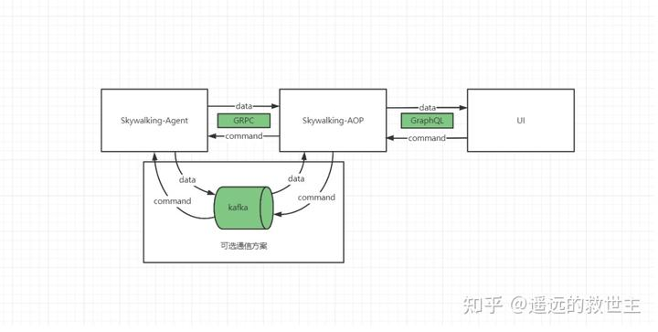

# SkyWalking 应用篇

参考资料：

+ [中文翻译文档](https://skyapm.github.io/document-cn-translation-of-skywalking/zh/8.0.0/)
+ [OpenTracing标准规范](https://github.com/opentracing-contrib/opentracing-specification-zh/blob/master/specification.md)
+ [Dapper，大规模分布式系统的跟踪系统](https://www.iocoder.cn/Fight/Dapper-translation//)
+ [Skywalking解析](https://www.zhihu.com/column/c_1551681469726212096)


## 框架对比

+ skywalking
+ zipkin
+ pinpoint
+ CAT


## 架构

### 架构组成

skywalking的组件：https://skywalking.apache.org/docs/


**数据收集**：包含各种语言自动探针，可对各语言各种服务框架的调用链路进行追踪

+ Agent
  + Java Agent
  + Python Agent
  + Go Agent
  + NodeJS Agent
  + ...
+ SDK
+ Service Mesh

> 基本所有软件都可以用skywalking追踪调用链路，只要有可用的探测钩子且能将钩子放到软件对应的进程中（和debug工具原理类似）；
> 比如：追踪SpringMVC框架接口调用链路，追踪JDBC访问MySQL的调用链路，追踪Jedis访问Redis的调用链路，追踪RocketMQ的消息发送与消费的链路等。

**传输层协议**：

借张图：



+ Data Collect Protocol
+ Query Protocol
+ Go API

**OAP**（Observability Analysis Platform，可观测的分析平台)：

+ OAL（Observability Analysis Language）: 用来进行度量分析的DSL，类似于SQL，用于查询度量分析结果和 警报。

**持久化**（支持多种数据库）：

+ ES
+ MySQL
+ TiDB
+ H2
+ BanyanDB
+ ...

**界面（GUI/CLI）**：支持图形和命令行界面

+ SkyWalking UI
+ Booster UI
+ Grafana Plugins

### 源码目录

```shell
.
├── apm-checkstyle
│   └── checkStyle.xml		#代码规范校验，官方文档：https://checkstyle.sourceforge.io/index.html
├── apm-dist
├── apm-protocol
│   ├── apm-network
├── apm-webapp
├── codeStyle.xml
├── dist-material
│   ├── alarm-settings.yml
│   ├── bin
│   │   ├── oapService.bat
│   │   ├── oapServiceInit.bat
│   │   ├── oapServiceInit.sh
│   │   ├── oapServiceNoInit.bat
│   │   ├── oapServiceNoInit.sh
│   │   ├── oapService.sh
│   │   ├── startup.bat
│   │   ├── startup.sh
│   │   ├── webappService.bat
│   │   └── webappService.sh
│   ├── config-examples
│   │   ├── alarm-settings.yml
│   │   ├── lal.yaml
│   │   └── log-mal.yaml
│   ├── log4j2.xml
│   └── release-docs
├── docker
│   ├── data-generator
│   ├── docker-compose.yml
│   ├── oap
│   └── ui
├── docs
├── HEADER
├── lombok.config
├── Makefile
├── oap-server
│   ├── analyzer
│   │   ├── agent-analyzer
│   │   ├── analyzer.iml
│   │   ├── event-analyzer
│   │   ├── log-analyzer
│   │   ├── meter-analyzer
│   │   └── pom.xml
│   ├── exporter
│   │   ├── exporter.iml
│   │   ├── pom.xml
│   │   └── src
│   ├── microbench
│   │   ├── microbench.iml
│   │   ├── pom.xml
│   │   └── src
│   ├── oal-grammar
│   │   ├── oal-grammar.iml
│   │   ├── pom.xml
│   │   └── src
│   ├── oal-rt
│   │   ├── oal-rt.iml
│   │   ├── pom.xml
│   │   └── src
│   ├── oap-server.iml
│   ├── pom.xml
│   ├── server-alarm-plugin
│   │   ├── pom.xml
│   │   ├── server-alarm-plugin.iml
│   │   └── src
│   ├── server-cluster-plugin
│   │   ├── cluster-consul-plugin
│   │   ├── cluster-etcd-plugin
│   │   ├── cluster-kubernetes-plugin
│   │   ├── cluster-nacos-plugin
│   │   ├── cluster-standalone-plugin
│   │   ├── cluster-zookeeper-plugin
│   │   ├── pom.xml
│   │   └── server-cluster-plugin.iml
│   ├── server-configuration
│   │   ├── configuration-api
│   │   ├── configuration-apollo
│   │   ├── configuration-consul
│   │   ├── configuration-etcd
│   │   ├── configuration-k8s-configmap
│   │   ├── configuration-nacos
│   │   ├── configuration-zookeeper
│   │   ├── grpc-configuration-sync
│   │   ├── pom.xml
│   │   └── server-configuration.iml
│   ├── server-core
│   │   ├── pom.xml
│   │   ├── server-core.iml
│   │   └── src
│   ├── server-fetcher-plugin
│   │   ├── kafka-fetcher-plugin
│   │   ├── pom.xml
│   │   └── server-fetcher-plugin.iml
│   ├── server-health-checker
│   │   ├── pom.xml
│   │   ├── server-health-checker.iml
│   │   └── src
│   ├── server-library
│   │   ├── library-client
│   │   ├── library-datacarrier-queue
│   │   ├── library-elasticsearch-client
│   │   ├── library-kubernetes-support
│   │   ├── library-module
│   │   ├── library-server
│   │   ├── library-util
│   │   ├── pom.xml
│   │   └── server-library.iml
│   ├── server-query-plugin
│   │   ├── mqe-grammar
│   │   ├── pom.xml
│   │   ├── promql-plugin
│   │   ├── query-graphql-plugin
│   │   ├── server-query-plugin.iml
│   │   └── zipkin-query-plugin
│   ├── server-receiver-plugin
│   │   ├── aws-firehose-receiver
│   │   ├── configuration-discovery-receiver-plugin
│   │   ├── envoy-metrics-receiver-plugin
│   │   ├── otel-receiver-plugin
│   │   ├── receiver-proto
│   │   ├── server-receiver-plugin.iml
│   │   ├── skywalking-browser-receiver-plugin
│   │   ├── skywalking-clr-receiver-plugin
│   │   ├── skywalking-ebpf-receiver-plugin
│   │   ├── skywalking-event-receiver-plugin
│   │   ├── skywalking-jvm-receiver-plugin
│   │   ├── skywalking-log-recevier-plugin
│   │   ├── skywalking-management-receiver-plugin
│   │   ├── skywalking-mesh-receiver-plugin
│   │   ├── skywalking-meter-receiver-plugin
│   │   ├── skywalking-profile-receiver-plugin
│   │   ├── skywalking-sharing-server-plugin
│   │   ├── skywalking-telegraf-receiver-plugin
│   │   ├── skywalking-trace-receiver-plugin
│   │   ├── skywalking-zabbix-receiver-plugin
│   │   └── zipkin-receiver-plugin
│   ├── server-starter																		#OAP服务启动模块，OAP Server 配置文件都在这里
│   ├── server-storage-plugin														#存储插件支持，微内核通过插件拓展 		
│   │   ├── pom.xml
│   │   ├── server-storage-plugin.iml										#默认H2
│   │   ├── storage-banyandb-plugin										 #banyandb
│   │   ├── storage-elasticsearch-plugin								#支持通过ES持久化数据
│   │   ├── storage-jdbc-hikaricp-plugin								#jdbc + hikaricp 连接池
│   │   ├── storage-shardingsphere-plugin
│   │   └── storage-tidb-plugin
│   ├── server-telemetry
│   │   ├── telemetry-api
│   │   └── telemetry-prometheus
│   ├── server-testing
│   └── server-tools
│       ├── data-generator
│       ├── profile-exporter
├── oap-server-bom
├── pom.xml
├── README.md
├── skywalking-ui
├── test
│   ├── e2e-v2
│   │   ├── cases
│   │   ├── java-test-service
│   │   └── script
│   └── Makefile
└── tools
    ├── profile-exporter
    ├── releasing
    │   └── create_source_release.sh
    └── TLS
        └── tls_key_generate.sh
```


## 部署

### 单机部署

#### 组件选型：

+ 跟踪目标：SpringBoot应用

+ 数据采集：SkyWalking Agent

+ OAP Server: v9.3.0 (这是最后一个支持jdk8的版本)

  配置文件：

  - application.yml
  - log4j.xml
  - alarm-settings.yml

+ 数据存储：ElasticSearch

  > 选择ES作为持久化工具，详细配置参考 application.yml  `storage.elasticsearch`配置项。
  >
  > ```shell
  > storage:
  >   selector: ${SW_STORAGE:h2}	# 选择哪种持久化方案
  >   elasticsearch:
  >   	...
  > ```

+ 其他

  + 日志
  + 监控
  + UI

#### docker部署（快速开发测试）

参考：[How to use the Docker images](https://skywalking.apache.org/docs/main/v9.4.0/en/setup/backend/backend-docker/)

```shell
# 这里全部使用本地网络 机器内存紧张的话会报内存不足的异常
# docker 启动 elasticsearch
docker run --name es-single \
-e "discovery.type=single-node" \
-e "cluster.routing.allocation.disk.watermark.low=97%" \
-e "cluster.routing.allocation.disk.watermark.high=98%" \
-e "cluster.routing.allocation.disk.watermark.flood_stage=99%" \
-e "xpack.security.enabled=false" \
-e "xpack.security.http.ssl:enabled=false" \
-e ES_JAVA_OPTS="-Xms256m -Xmx1024m" \
--network host \
-d elasticsearch:8.8.0

# ElasticHD, UI 端口9800
docker run  --name es-hd-single --network host -d containerize/elastichd:latest

# docker 启动 skywalking OAP, 9.4.0 最低要求 jdk-11.0.18+10，这里改成9.3.0
# docker run 不支持通过容器名称调用，docker-compose可以
docker run --name oap-server-single \
	-e TZ=Asia/Shanghai \
    -e SW_STORAGE=elasticsearch \
    -e SW_CORE_REST_PORT=12801 \
    -e SW_CORE_GRPC_PORT=11801 \
    -e SW_STORAGE_ES_CLUSTER_NODES=127.0.0.1:9200  \
    -e JAVA_OPTS="-Xms256m -Xmx1G " \
    --security-opt=seccomp:unconfined \
    --network host \
    -d apache/skywalking-oap-server:9.3.0

# skywalking GUI
docker run --name skywalking-ui-single \
	-e TZ=Asia/Shanghai \
	-e SW_OAP_ADDRESS=http://127.0.0.1:12801 \
	--network host \
	-d apache/skywalking-ui:9.3.0    
```

> oap-server 9.4.0 docker 部署一直报错，显示端口占用，但是端口并没有被占用：
>
> 2023-06-09 19:59:42,158 org.apache.skywalking.oap.server.starter.OAPServerBootstrap 57 [main] ERROR [] - [9.4.0-520d531] io.netty.channel.unix.Errors$NativeIoException: bind(..) failed: Address already in use
> java.util.concurrent.CompletionException: io.netty.channel.unix.Errors$NativeIoException: bind(..) failed: Address already in use
> 	at java.util.concurrent.CompletableFuture.reportJoin(Unknown Source) ~[?:?]
> 	at java.util.concurrent.CompletableFuture.join(Unknown Source) ~[?:?]
> 	at com.linecorp.armeria.common.util.EventLoopCheckingFuture.join(EventLoopCheckingFuture.java:87) ~[armeria-1.21.0.jar:?]
> 	at org.apache.skywalking.oap.server.library.server.http.HTTPServer.start(HTTPServer.java:120) ~[library-server-9.4.0.jar:9.4.0]
> 	at org.apache.skywalking.oap.query.promql.PromQLProvider.notifyAfterCompleted(PromQLProvider.java:89) ~[promql-plugin-9.4.0.jar:9.4.0]
> 	at org.apache.skywalking.oap.server.library.module.BootstrapFlow.notifyAfterCompleted(BootstrapFlow.java:52) ~[library-module-9.4.0.jar:9.4.0]
> 	at org.apache.skywalking.oap.server.library.module.ModuleManager.init(ModuleManager.java:61) ~[library-module-9.4.0.jar:9.4.0]
> 	at org.apache.skywalking.oap.server.starter.OAPServerBootstrap.start(OAPServerBootstrap.java:43) [server-starter-9.4.0.jar:9.4.0]
> 	at org.apache.skywalking.oap.server.starter.OAPServerStartUp.main(OAPServerStartUp.java:23) [server-starter-9.4.0.jar:9.4.0]
> Caused by: io.netty.channel.unix.Errors$NativeIoException: bind(..) failed: Address already in use
>
> 临时先换成9.0.0版本，端口占用问题后面再看。

#### 源码部署（源码调试，分析实现原理）

+ **源码编译**

  编译方法：[How to build](https://github.com/apache/skywalking/blob/master/docs/en/guides/How-to-build.md)

  skywalking 源码包含git[子模块](https://git-scm.com/book/zh/v2/Git-%E5%B7%A5%E5%85%B7-%E5%AD%90%E6%A8%A1%E5%9D%97)，`cat .gitmodules`可以看到包含下面４个子模块。

  ```ini
  [submodule "apm-protocol/apm-network/src/main/proto"]
          path = apm-protocol/apm-network/src/main/proto
          url = https://github.com/apache/skywalking-data-collect-protocol.git
  [submodule "oap-server/server-query-plugin/query-graphql-plugin/src/main/resources/query-protocol"]
          path = oap-server/server-query-plugin/query-graphql-plugin/src/main/resources/query-protocol
          url = https://github.com/apache/skywalking-query-protocol.git
  [submodule "test/e2e-v2/java-test-service/e2e-protocol/src/main/proto"]
          path = test/e2e-v2/java-test-service/e2e-protocol/src/main/proto
          url = https://github.com/apache/skywalking-data-collect-protocol.git
  [submodule "skywalking-ui"]
          path = skywalking-ui
          url = https://github.com/apache/skywalking-booster-ui.git
  ```

  经查看官方文档发现最后一个支持JDK8的版本是v9.3.0。先将主模块和所有子模块代码全部切换到这个版本。

  ```shell
  git submodule foreach 'git checkout -b v9.3.0 v9.3.0'
  ```

  执行编译

  ```shell
  # 注意maven版本也是有要求的，如果版本太低升级下再编译，或者使用项目自带的mvnw下载（没有此版本也是会自动下载）
  mvn clean package -Dmaven.test.skip
  ```

  编译过程中可能遇到 npm run build 报错，注释掉 apm-webapp 下面代码, 不编译UI, 经测试不影响 OAPServer 启动。估计是本地 node 和 npm 太旧了，可以更新到指定的v16.14.0版本试试，下载地址：https://nodejs.org/download/release/v16.14.0/。

  ```xml
  <!--<plugin>-->
  <!--    <groupId>com.github.eirslett</groupId>-->
  <!--    <artifactId>frontend-maven-plugin</artifactId>-->
  <!--    <version>${frontend-maven-plugin.version}</version>-->
  <!--    <configuration>-->
  <!--        <workingDirectory>${ui.path}</workingDirectory>-->
  <!--        <nodeVersion>v16.14.0</nodeVersion>-->
  <!--    </configuration>-->
  <!--    <executions>-->
  <!--        <execution>-->
  <!--            <id>install node and npm</id>-->
  <!--            <goals>-->
  <!--                <goal>install-node-and-npm</goal>-->
  <!--            </goals>-->
  <!--        </execution>-->
  <!--        <execution>-->
  <!--            <id>npm install</id>-->
  <!--            <goals>-->
  <!--                <goal>npm</goal>-->
  <!--            </goals>-->
  <!--            <configuration>-->
  <!--                &lt;!&ndash;<arguments>install &#45;&#45;registry=https://registry.npmjs.org/</arguments>&ndash;&gt;-->
  <!--                <arguments>install &#45;&#45;registry=https://registry.npm.taobao.org/</arguments>-->
  <!--            </configuration>-->
  <!--        </execution>-->
  <!--        <execution>-->
  <!--            <id>npm run build</id>-->
  <!--            <goals>-->
  <!--                <goal>npm</goal>-->
  <!--            </goals>-->
  <!--            <configuration>-->
  <!--                <arguments>run build</arguments>-->
  <!--            </configuration>-->
  <!--        </execution>-->
  <!--    </executions>-->
  <!--</plugin>-->
  ```

  设置 GRPC 的**自动生成**的代码目录，但是我没设置也启动成功了。

  > 个人电脑上测试编译源码（LinuxMint21，自带 node v14.16.0），并没有出现 npm 报错，但是需要设置 grpc **Generated Source Root**。

  

+ **源码启动**


### 集群部署


### 可定制配置

#### 持久化配置详解

#### 配置优化减少存储空间占用

+ 客户端
  + 配置采样率
+ 服务端
  + 定期清理过期数据间隔
  + 明细数据存储有效时间
  + 度量数据存储有效时间


## 应用链路追踪

### 基本使用

下载 SkyWalking [JavaAgent](https://dlcdn.apache.org/skywalking/java-agent/)。

IDEA `Run/Debug Configuration`配置：

```
VM options: -javaagent:/home/lee/lib/skywalking/skywalking-agent/skywalking-agent.jar
Environment variables: SW_AGENT_NAME=demo-application;SW_AGENT_COLLECTOR_BACKEND_SERVICES=127.0.0.1:11800;SW_AGENT_SPAN_LIMIT=2000
```

然后启动应用，发送请求，就会自动通过11800端口向skywalking上报数据。

###  自定义链路追踪

SkyWalking 提供的插件基本都是对某些关键方法的拦截，比如 mvc-annotation-5.x-plugin 里面提供了几个拦截器，对 Controller 方法、 HandlerMethod方法拦截，并不支持对Service层方法进行拦截。如果需要对Service层方法进行链路追踪，可以通过引入依赖 [apm-toolkit-trace](https://skywalking.apache.org/docs/skywalking-java/v8.14.0/en/setup/service-agent/java-agent/application-toolkit-trace/) 实现。

#### apm-toolkit-trace 使用方式

+ API
+ @Trace注解

#### apm-toolkit-trace 实现原理

根据使用方式以及SkyWalking-Agent工作原理推测：就是借助线程本地变量（ThreadLocal, 比如 ContextManager 中的 CONTEXT）传参，可以获取服务对应插件初始化的追踪上下文（TraceContext），然后 apm-toolkit-trace  只需要获取自定义追踪方法的追踪信息追加到追踪上下文即可。

### 禁用插件、取消追踪

一方面业务中确实不需要追踪某些数据，另外方便源码调试（默认加载全部插件的情况下可能一个Span经过了多个Inteceptor，研究原理时经常只想专注于一个Inteceptor）

#### 禁用插件

直接将agent目录中的插件的jar删除即可。这里应该可以理解为什么skywalking-agent中要将 agent 和 插件分开打包了吧，方便删除无用的Jar包。

另外也可以通过配置 `Config.Plugin.EXCLUDE_PLUGINS` 参数，禁止插件的加载。

#### 取消追踪

##### 使用 apm-trace-ignore-plugin 忽略追踪某些路径

两种配置方式：

+ config 目录新增 apm-trace-ignore-plugin.config

  ```properties
  trace.ignore_path=${SW_AGENT_TRACE_IGNORE_PATH:/eureka/**}
  ```

+ 添加环境变量

  ```shell
  -Dskywalking.trace.ignore_path=/eureka/**
  ```

#### agent.ignore_suffix

这个是 `org.apache.skywalking.apm.agent.core.conf.Config`的一个配置参数，用于忽略以特定后缀命名的 EntrySpan 的追踪。配置文件是agent.config。比如默认配置：

```properties
 # 默认配置
 "agent.ignore_suffix" -> ".jpg,.jpeg,.js,.css,.png,.bmp,.gif,.ico,.mp3,.mp4,.html,.svg"
 # 可以使用这种方式拓展
 agent.ignore_suffix=${SW_AGENT_IGNORE_SUFFIX:.htm}
```

### 设置采样

为了减少采集数据量，降低对业务服务性能的影响；基本没必要对每个请求的数据都进行采集追踪。SkyWalking 对业务服务性能的影响可忽略不计是不是主要归功于采样？TODO 为何 Zipkin、PinPoint 性能远逊色于 SkyWalking ？ 

为了保证链路完整，SkyWalking 会检测上游如果有携带 Context, 则下游强制采集数据。TODO 源码实现？

#### 客户端采样

配置文件：agent.conf

```properties
# 可以通过环境变量SW_AGENT_SAMPLE设置，默认全部
agent.sample_n_per_3_secs=${SW_AGENT_SAMPLE:-1}
# 修改默认为3秒100次，这个采样数是针对哪个指标说的？操作名称 operationName (每个操作名称3秒最多采样100次)?  
# 从 SamplingService 判断是否执行采样的方法 public boolean trySampling(String operationName) 看确实是针对 operationName
agent.sample_n_per_3_secs=${SW_AGENT_SAMPLE:100}
```

采样策略：

`org.apache.skywalking.apm.agent.core.sampling.SamplingService`中定义（实现了 BootService 接口，默认加载）。是固定采样：对某个操作（operationName）每3秒采样N次。

另外在 trace-sampler-cpu-policy-plugin 插件中拓展了按CPU使用率采样的策略（TraceSamplerCpuPolicyExtendService extends SamplingService），如果CPU使用率超过设置的值，就不再采样，未超过设置的值，再执行固定采样策略。

#### 服务端采样

官方文档：[Trace Sampling](https://skywalking.apache.org/docs/main/v9.0.0/en/setup/backend/trace-sampling/#set-the-sample-rate)

设置采样率：

```yaml
agent-analyzer:
  default:
    ...
    # The default sampling rate and the default trace latency time configured by the 'traceSamplingPolicySettingsFile' file.
    traceSamplingPolicySettingsFile: ${SW_TRACE_SAMPLING_POLICY_SETTINGS_FILE:trace-sampling-policy-settings.yml}
    forceSampleErrorSegment: ${SW_FORCE_SAMPLE_ERROR_SEGMENT:true} # When sampling mechanism activated, this config would make the error status segment sampled, ignoring the sampling rate.
```

trace-sampling-policy-settings.yml

```yaml
default:
  # Default sampling rate that replaces the 'agent-analyzer.default.sampleRate'
  # The sample rate precision is 1/10000. 10000 means 100% sample in default.
  rate: 10000
  # Default trace latency time that replaces the 'agent-analyzer.default.slowTraceSegmentThreshold'
  # Setting this threshold about the latency would make the slow trace segments sampled if they cost more time, even the sampling mechanism activated. The default value is `-1`, which means would not sample slow traces. Unit, millisecond.
  duration: -1
#services:
#  - name: serverName
#    rate: 1000 # Sampling rate of this specific service
#    duration: 10000 # Trace latency threshold for trace sampling for this specific service
```

### 日志嵌入TraceId

### 使用告警

### 自定义插件

与业务需求适配的官方插件没有就需要自定义插件。大部分情况可能只是在业务代码中想拓展些更详细的追踪数据，其实可以使用apm-toolkit-trace，没必要自定义插件。


## 9.x面板说明


## 插件

9.x的插件都在独立的项目中，比如Java相关的插件位于 https://github.com/apache/skywalking-java

主要目录：

```
apm-sniffer																		#  Application Performance Management Sniffer 意为应用性能管理嗅探
├── apm-agent
│   ├── pom.xml
│   └── src
├── apm-agent-core
│   ├── pom.xml
│   └── src
├── apm-sdk-plugin
│   ├── activemq-5.x-plugin
│   ├── apm-armeria-plugins
│   ├── asynchttpclient-2.x-plugin
│   ├── avro-plugin
│   ├── baidu-brpc-3.x-plugin
│   ├── baidu-brpc-plugin
│   ├── canal-1.x-plugin
│   ├── cassandra-java-driver-3.x-plugin
│   ├── clickhouse-0.3.1-plugin
│   ├── clickhouse-0.3.2.x-plugin
│   ├── cxf-3.x-plugin
│   ├── dbcp-2.x-plugin
│   ├── druid-1.x-plugin
│   ├── dubbo-2.7.x-conflict-patch
│   ├── dubbo-2.7.x-plugin
│   ├── dubbo-3.x-conflict-patch
│   ├── dubbo-3.x-plugin
│   ├── dubbo-conflict-patch
│   ├── dubbo-plugin
│   ├── elastic-job-2.x-plugin
│   ├── elasticjob-3.x-plugin
│   ├── elasticsearch-5.x-plugin
│   ├── elasticsearch-6.x-plugin
│   ├── elasticsearch-7.x-plugin
│   ├── feign-default-http-9.x-plugin
│   ├── finagle-6.25.x-plugin
│   ├── graphql-plugin
│   ├── grizzly-2.3.x-4.x-plugin
│   ├── grizzly-2.3.x-4.x-work-threadpool-plugin
│   ├── grpc-1.x-plugin
│   ├── guava-eventbus-plugin
│   ├── h2-1.x-plugin
│   ├── hbase-1.x-2.x-plugin
│   ├── hikaricp-3.x-4.x-plugin
│   ├── httpasyncclient-4.x-plugin
│   ├── httpclient-3.x-plugin
│   ├── httpClient-4.x-plugin
│   ├── httpclient-5.x-plugin
│   ├── httpclient-commons
│   ├── hutool-plugins
│   ├── hystrix-1.x-plugin
│   ├── impala-jdbc-2.6.x-plugin
│   ├── influxdb-2.x-plugin
│   ├── jdbc-commons
│   ├── jedis-plugins
│   ├── jersey-2.x-plugin
│   ├── jersey-3.x-plugin
│   ├── jetty-plugin
│   ├── jetty-thread-pool-plugin
│   ├── jsonrpc4j-1.x-plugin
│   ├── kafka-commons
│   ├── kafka-plugin
│   ├── kylin-jdbc-2.6.x-3.x-4.x-plugin
│   ├── lettuce-5.x-plugin
│   ├── light4j-plugins
│   ├── mariadb-2.x-plugin
│   ├── micronaut-plugins
│   ├── mongodb-2.x-plugin
│   ├── mongodb-3.x-plugin
│   ├── mongodb-4.x-plugin
│   ├── motan-plugin
│   ├── mssql-commons
│   ├── mssql-jdbc-plugin
│   ├── mssql-jtds-1.x-plugin
│   ├── mysql-5.x-plugin
│   ├── mysql-6.x-plugin
│   ├── mysql-8.x-plugin
│   ├── mysql-common
│   ├── nats-2.14.x-2.15.x-plugin
│   ├── neo4j-4.x-plugin
│   ├── netty-socketio-plugin
│   ├── nutz-plugins
│   ├── okhttp-2.x-plugin
│   ├── okhttp-3.x-plugin
│   ├── okhttp-4.x-plugin
│   ├── okhttp-common
│   ├── play-2.x-plugin
│   ├── pom.xml
│   ├── postgresql-8.x-plugin
│   ├── pulsar-2.2-2.7-plugin
│   ├── pulsar-2.8.x-plugin
│   ├── pulsar-common
│   ├── quasar-plugin
│   ├── rabbitmq-plugin
│   ├── redisson-3.x-plugin
│   ├── resteasy-plugin
│   ├── rocketMQ-3.x-plugin
│   ├── rocketMQ-4.x-plugin
│   ├── rocketMQ-5.x-plugin
│   ├── servicecomb-plugin
│   ├── shardingsphere-plugins
│   ├── sofarpc-plugin
│   ├── solrj-7.x-plugin
│   ├── spring-plugins
│   ├── spymemcached-2.x-plugin
│   ├── struts2-2.x-plugin
│   ├── thrift-plugin
│   ├── tomcat-10x-plugin
│   ├── tomcat-7.x-8.x-plugin
│   ├── tomcat-thread-pool-plugin
│   ├── undertow-plugins
│   ├── undertow-worker-thread-pool-plugin
│   ├── vertx-plugins
│   ├── xmemcached-2.x-plugin
│   └── xxl-job-2.x-plugin
├── apm-test-tools
│   ├── pom.xml
│   └── src
├── apm-toolkit-activation
│   ├── apm-toolkit-kafka-activation
│   ├── apm-toolkit-log4j-1.x-activation
│   ├── apm-toolkit-log4j-2.x-activation
│   ├── apm-toolkit-logback-1.x-activation
│   ├── apm-toolkit-logging-common
│   ├── apm-toolkit-meter-activation
│   ├── apm-toolkit-micrometer-activation
│   ├── apm-toolkit-opentracing-activation
│   ├── apm-toolkit-trace-activation
│   ├── apm-toolkit-webflux-activation
│   └── pom.xml
├── bootstrap-plugins
│   ├── jdk-forkjoinpool-plugin
│   ├── jdk-http-plugin
│   ├── jdk-threading-plugin
│   ├── jdk-threadpool-plugin
│   └── pom.xml
├── config
│   └── agent.config
├── optional-plugins
│   ├── customize-enhance-plugin
│   ├── ehcache-2.x-plugin
│   ├── fastjson-1.2.x-plugin
│   ├── gson-2.8.x-plugin
│   ├── guava-cache-plugin
│   ├── jackson-2.x-plugin
│   ├── kotlin-coroutine-plugin
│   ├── mybatis-3.x-plugin
│   ├── optional-spring-plugins
│   ├── pom.xml
│   ├── quartz-scheduler-2.x-plugin
│   ├── sentinel-1.x-plugin
│   ├── shenyu-2.4.x-plugin
│   ├── trace-ignore-plugin
│   ├── trace-sampler-cpu-policy-plugin
│   └── zookeeper-3.4.x-plugin
├── optional-reporter-plugins
│   ├── kafka-config-extension
│   ├── kafka-reporter-plugin
│   └── pom.xml
└── pom.xml
```

常用插件说明：

+ trace-ignore-plugin 

  忽略部分 URL 的追踪

+ ...


