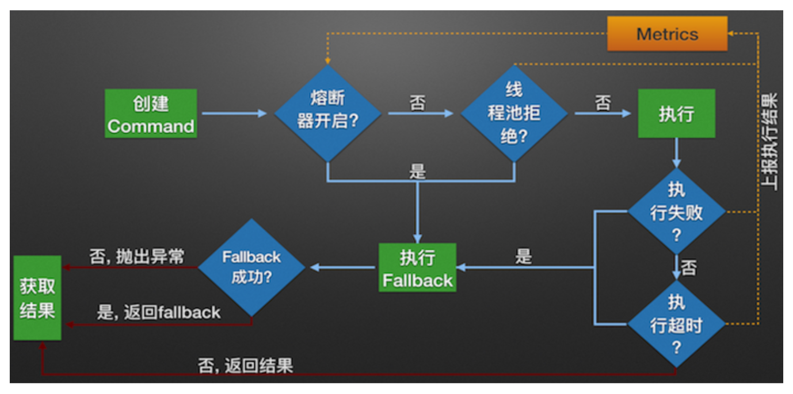

# Hystrix 使用及原理

`Hystrix`是一个提供了`超时机制`、`限流`、`熔断降级`全套功能的延迟和容错库。

可以解决或优化因`程序Bug`、`大流量请求(秒杀、大促、缓存击穿)`、`硬件故障`导致的服务不可用及服务雪崩问题。

功能说明：

**超时机制**：体现在线程隔离的超时中断属性（当线程执行超时时默认会中断线程的执行）。

**限流**：体现在`Hystrix`的隔离策略（线程隔离：利用线程池线程数量上限，请求数量达到上限继续请求会阻塞进行限制; 信号量隔离：利用信号量数量上限进行限制）。

**熔断降级**：熔断一般伴随者降级，熔断即完全拒绝服务。

当在时间窗内(默认10 秒)收到的请求数量超过该设置的阈值（默认20）后,将开启熔断器。

当请求的错误率高于设置的错误率时,开启熔断器。默认值为 50，即 50%。

熔断器可以强制开启或强制关闭。

相关配置项参考：`HystrixCommandProperties`。

## 使用篇

### 命令行/Spring 应用

#### 导入依赖

#### 超时机制

#### 服务限流

#### 服务熔断降级

#### 端点监控

### Spring Boot/Cloud 应用

#### 导入依赖

#### 超时机制

#### 服务限流

#### 服务熔断降级

#### 端点监控

#### Hystrix+dashboard监控

#### turbine集群监控

## 原理篇

Hystrix服务调用内部逻辑：

Hystrix服务调用源码实现：

