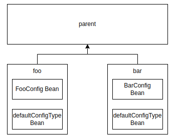
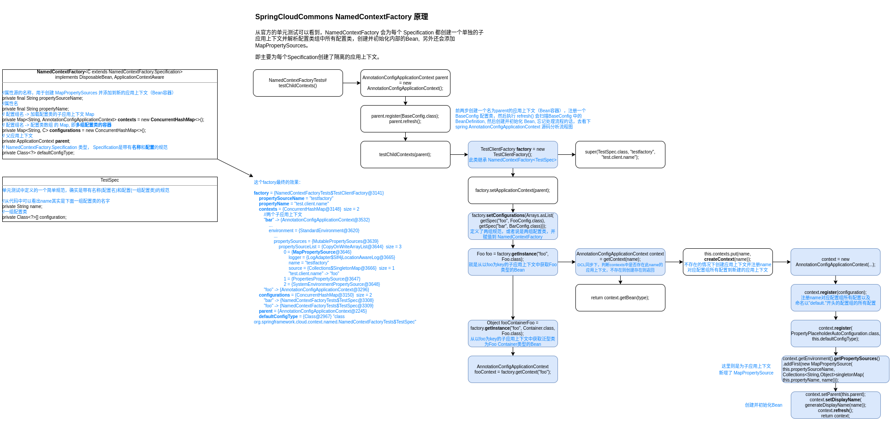

# [NamedContextFactory](https://github.com/spring-cloud/spring-cloud-commons/blob/main/spring-cloud-context/src/main/java/org/springframework/cloud/context/named/NamedContextFactory.java)

官方注释：

Creates a set of child contexts that allows a set of Specifications to define the beans in each child context.

官方有提供单元测试`NamedContextFactoryTests`，先从这个单元测试理解，然后再回归到`Spring Cloud LoadBalancer`的业务中理解其原理和功能。

从官方的单元测试 NamedContextFactoryTests 可以看到，**NamedContextFactory 会为每个 Specification 都创建一个单独的子应用上下文并解析配置类组中所有配置类，创建并初始化内部的Bean, 另外还会添加 MapPropertySources**。

即主要**为每个Specification创建了隔离的应用上下文**，隔离的就是 Specification 中定义的配置类，不过可以通过 defaultConfigType 加载相同的配置类，不过创建的defaultConfigType配置类中定义的Bean也是各个应用上下文各有一份。

源码很简单看下面的流程图即可。

然后回归负载均衡的处理流程，再看下 NamedContextFactory 的妙用。

